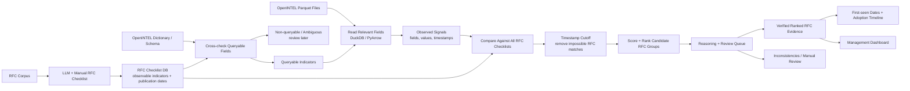

# OpenINTEL RFC-Adoption Matching Pipeline

Match large-scale DNS/DNSSEC measurement data from [OpenINTEL](https://openintel.nl)
against a database of RFC checklists, and produce **ranked RFC candidates with
explicit, inspectable reasoning** — not a single opaque label.

## Status

Working, and verified against the real corpus — not only the shipped fixture.

A run over live OpenINTEL data (`source=nu`, 2018-05-01..03, **7,861,083 rows in
3m46s**) produced these counts, every one of which was reproduced exactly by
hand-written SQL issued directly against the same S3 objects:

| Rank | RFC | Mechanism | Observations |
| --- | --- | --- | --- |
| 1 | RFC 5155 | NSEC3 | 1,226,569 |
| 2 | RFC 6605 | ECDSA | 82,773 |
| 3 | RFC 7344 | CDS/CDNSKEY | 537 |
| 4 | RFC 4509 | SHA-256 DS | 394,783 |
| 5 | RFC 4033 | base DNSSEC | 6,633,977 |

Note RFC 4033 ranking **last** on 6.6M observations while RFC 7344 ranks third on
537. That is the specificity weighting working: a CDS record says something
specific, a DNSKEY record says only "this zone is signed".

**718 tests pass.** All 10 dashboard pages load clean. Two runs of the same range
are byte-identical apart from the recorded output path.

### Two execution paths, and they are not interchangeable

| | `analyze` | `scale` |
| --- | --- | --- |
| Input | one local Parquet file | the OpenINTEL S3 corpus, many partitions |
| Built for | ~10⁴–10⁶ rows | 10⁹–10¹¹ rows |
| Matching | Python, row by row | pushed into DuckDB SQL |
| Output | one signal and one trace **per row** | **exact aggregates** + a *sampled* set of traces |
| Resumable | not needed | yes, per-partition checkpoints |

Both use the same checklist, the same scoring formula and the same decision rules;
a cross-validation test asserts the two engines produce identical per-RFC counts,
`first_seen` and scores. What differs is only what can be materialized.

**Read [`docs/running_at_scale.md`](docs/running_at_scale.md) before quoting a
number from a `scale` run.** Its counts are exact; its scores and reasoning traces
come from a bounded sample.

## Quickstart

Everything below runs from the repository root. The rest of this README explains
*why*; this section is just how to operate it.

**Try it offline (about a minute, no network, no credentials):**

```bash
pip install -r requirements.txt
make demo          # sample data -> tool survey -> schema-check -> analyze
less demo_output/report.md
make dashboard     # http://localhost:8501
```

**Run it against real OpenINTEL data (Linux server):**

```bash
./scripts/setup.sh                                   # ~5 min, installs + self-verifies

# Costs seconds, scans nothing. Do this for every new range.
./scripts/run_full_analysis.sh --sources nu --start 2018-05-01 --end 2018-05-01 --dry-run

# One real day, end to end. ~35 s. Prove the path before scaling it.
./scripts/run_full_analysis.sh --sources nu --start 2018-05-01 --end 2018-05-01

# The real run. Hours to days, resumable. See "Operating a long run" below.
tmux new -s openintel
./scripts/run_full_analysis.sh --mode download --cache-dir /large/volume \
    --sources nu,se --start 2015-01-01 --end 2021-12-31 --pace-seconds 2
```

**Where to look afterwards:**

| Question | File |
| --- | --- |
| What did this run conclude? | `report.md` — start here, it is written to be read top to bottom |
| Which RFCs ranked, with what evidence? | `ranked_candidates.json` (§7 of the report) |
| *Why* did RFC X match, or not? | `reasoning_traces.json`, or dashboard page 6 |
| When did each RFC first appear? | `adoption_timeline.json` (§9) |
| What should a human check? | `review_queue.json` (§12), high severity first |
| What did the run actually read? | `run_manifest.json` — inputs, row counts, warnings |

`make verify` runs an 80-check full-system gate if you want to confirm the
install before trusting a result.

## Project goal

Given three inputs:

1. an **RFC checklist / signature database** (observable indicators + publication dates),
2. an **OpenINTEL dictionary / schema** (which fields the corpus actually exports),
3. **OpenINTEL-style Parquet files** of DNS measurements,

the system determines which RFCs are *consistent with* the observed signals, how
strongly, since when, and — critically — **why**.

## What the system does

- Cross-checks every RFC-derived indicator against the OpenINTEL dictionary and
  classifies it `queryable`, `partially_queryable`, `non_queryable`, or `ambiguous`.
- Reads OpenINTEL Parquet with DuckDB (projection pushdown; pandas/PyArrow fallback),
  resolving real column names (`response_type`, `cds_algorithm`, …) to normalized
  analysis fields (`rr_type`, `algorithm`, …).
- Extracts normalized **observed signals** from measurement rows.
- Compares **every** observed signal against **every** RFC checklist. It never picks
  one RFC up front, and a signal is allowed to match several RFCs at once.
- Applies **publication-date cutoff logic**: an observation that predates an RFC
  cannot evidence its adoption.
- Ranks candidate RFCs with an itemized, reproducible score.
- Emits a **structured decision trace** for every single signal × RFC evaluation —
  matches, partial matches, rejections, and timestamp-invalid cases alike.
- Routes missing fields, ambiguity, and inconsistencies to a **review queue**.
- Exports JSON, CSV and Markdown, and ships a nine-page Streamlit dashboard.
- At corpus scale: discovers S3 partitions, streams or downloads them, pushes the
  match into SQL, **checkpoints every partition** so an interrupted multi-day run
  resumes, and survives object-store throttling.

## What the system does *not* claim

> This pipeline does not prove RFC adoption by itself. It identifies ranked RFC
> candidates based on OpenINTEL-observable signals and timestamp consistency.

Concretely:

- A record matching an RFC's signature shows the *mechanism* is present. It does not
  show the operator read the RFC, nor that the deployment is conformant.
- Broad base-DNSSEC RFCs (4033/4034/4035) match almost any signed zone. Their low
  specificity multiplier reflects that; they are evidence of DNSSEC, not of a choice.
- Recommendation-oriented RFCs (e.g. 8624) are **not** directly observable. Their
  indicators are marked ambiguous and always routed to review.
- Absence of a signal is not evidence of absence: it may mean the corpus does not
  export the field, or the measurement did not cover the name.
- The shipped sample Parquet is **synthetic**, built to exercise every code path.
- In a `scale` run, observation counts are exact but **scores and reasoning traces
  are derived from a sample**. A candidate's score is a lower bound, and an RFC can
  hold millions of corpus observations yet be absent from the ranking because no
  sampled exemplar scored above the threshold. The run warns explicitly when that
  happens; it is a real limitation, not a display quirk.

## Architecture overview



Module map (`src/openintel_rfc/`):

| Module | Responsibility |
| --- | --- |
| `models.py` | Pydantic models for every artefact; the integration contract |
| `config.py` | Constants, scoring parameters, output file names |
| `utils.py` | Deterministic IO, timestamp parsing, ID minting |
| `checklist_loader.py` | Load + validate the checklist DB and dictionary |
| `rfc_metadata.py` | RFC metadata interface (offline default; Datatracker/RFCXML seams) |
| `schema_checker.py` | Indicator × dictionary cross-check and queryability verdicts |
| `parquet_reader.py` | DuckDB/PyArrow Parquet reads with alias resolution |
| `signal_extractor.py` | Parquet rows → normalized `ObservedSignal`s |
| `openintel_source.py` | S3 partition discovery; stream (httpfs) and download modes |
| `sql_compiler.py` | Compiles the checklist into SQL evaluated during the scan |
| `scale_runner.py` | Streaming aggregation, checkpointing, exemplar sampling |
| `matcher.py` | Condition/indicator evaluation, timestamp cutoff |
| `ranking.py` | Score breakdown, confidence, candidate aggregation |
| `reasoning.py` | Structured decision traces and their prose summaries |
| `timeline.py` | First-seen dates and adoption trajectories |
| `review_queue.py` | Everything a human should look at, with severity |
| `llm_verifier.py` | Verification interface + deterministic offline backend |
| `report.py` | `report.md` and the schema-check report |
| `exporters.py` | JSON / CSV / Markdown writers |
| `dashboard_data.py` | The dashboard's only data-access layer |
| `tool_survey.py` | Generates the open-source tool survey |
| `cli.py` | `tool-survey`, `schema-check`, `analyze` |

See [`docs/architecture.md`](docs/architecture.md) for the full data flow and
extension points.

## Selected open-source tool stack

| Tool | Role | Why |
| --- | --- | --- |
| **DuckDB** | Default Parquet query engine | SQL directly over Parquet with projection and predicate pushdown; zero-setup, single-file, ideal for OpenINTEL-shaped columnar data |
| **PyArrow** | Parquet IO | The Parquet backend, and the fallback read path |
| **pandas** | DataFrame handling | Simple manipulation, CSV/JSON export, native Streamlit rendering |
| **Pydantic** | Typed models | Malformed checklists fail loudly at load time instead of producing wrong matches |
| **Streamlit** | Dashboard | Multipage management UI in pure Python |
| **Plotly** | Charts | Interactive rankings, timelines and distributions |
| **pytest** | Tests | End-to-end and unit coverage |

Full evaluation — including what was deliberately rejected and why — is in
[`docs/open_source_tool_survey.md`](docs/open_source_tool_survey.md).

## The RFC checklist / signature database

`data/rfc_checklists/dnssec_rfc_checklists.json`. Each RFC carries `rfc_id`, `title`,
`publication_date`, `protocol`, `specificity`, `description`, `references`, `notes`,
and a list of `indicators`. Each indicator has an `id`, `description`, `required`
flag, `weight`, an `ambiguous` flag, and a list of `conditions`:

```json
{
  "id": "rfc8078_cds_cdnskey_algorithm_zero",
  "description": "CDS or CDNSKEY record with algorithm field 0 (the delete signal)",
  "required": true,
  "weight": 10,
  "conditions": [
    {"field": "rr_type", "op": "in", "value": ["CDS", "CDNSKEY"]},
    {"field": "algorithm", "op": "equals", "value": 0}
  ]
}
```

Conditions within an indicator are ANDed. Supported operators: `equals`,
`not_equals`, `in`, `exists`, `contains`, `greater_or_equal`, `less_or_equal`.

Shipped RFCs: **4033** (with 4034/4035, base DNSSEC), **4509** (SHA-256 DS digest),
**5155** (NSEC3), **6605** (ECDSA), **7344** (CDS/CDNSKEY), **8078** (delete signal),
**8080** (EdDSA), **8624** (algorithm recommendations).

To add an RFC, follow [`docs/adding_an_rfc.md`](docs/adding_an_rfc.md) — a worked
example covering the observability judgement, the entry format, verification
against real data, and what to do when the field you need is not in the dictionary.

Two indicators are intentionally *not* satisfiable by the shipped dictionary, so the
missing-field paths are exercised by the demo rather than only by tests:
`rfc8624_validator_algorithm_support` (non-queryable) and
`rfc4033_dnssec_ok_negotiated` (partially queryable).

## OpenINTEL dictionary / schema alignment

`data/openintel_dictionary/sample_openintel_dictionary.json` describes each analysis
field with a `type`, `description`, `available_from` date, and the real OpenINTEL
column names it derives from:

```json
{
  "name": "algorithm",
  "type": "integer",
  "available_from": "2010-01-01",
  "openintel_native_fields": ["dnskey_algorithm", "ds_algorithm", "rrsig_algorithm",
                              "cds_algorithm", "cdnskey_algorithm"]
}
```

The schema checker walks every condition of every indicator and reports, in prose,
whether the corpus can answer it. `available_from` matters: the dictionary's `flags`
field only becomes available in 2016, so any indicator depending on it cannot speak
to adoption before then — and the report says so explicitly rather than returning a
confident zero.

## Timestamp cutoff

For each signal × RFC pair the pipeline compares the observation timestamp with the
RFC's publication date. If `observation_timestamp < rfc_publication_date` the match is
`timestamp_invalid`: its score is forfeited to `0.0`, it is excluded from ranking and
from `first_seen`, and it is pushed to the review queue at **high** severity. The
score that *would* have been awarded is preserved in `score_breakdown.timestamp_penalty`,
so a reviewer can see exactly what was withheld.

This is what separates "these bytes look like RFC 8078" from "this is evidence of
RFC 8078 adoption". A CDS record with algorithm 0 in 2016 is a real observation of
something — but it cannot be adoption of a document published in March 2017.

## Ranking

```
base_indicator_score      = sum(weight of matched REQUIRED indicators)
optional_match_bonus      = sum(weight of matched OPTIONAL indicators) * 0.5
required_match_bonus      = 2.0  if the RFC has >= 2 required indicators and all matched
missing_required_penalty  = 3.0 * (required indicators evaluated and not matched)
partial_match_penalty     = 2.0  if some but not all required indicators matched
ambiguity_penalty         = 2.0  if any matched indicator is flagged ambiguous

final_score = max(0, base + required_bonus + optional_bonus
                     - missing_required_penalty - partial_match_penalty
                     - ambiguity_penalty) * specificity_multiplier
```

Specificity multipliers: `very_high 1.5`, `high 1.25`, `medium 1.0`, `low 0.75`.
Confidence bands: `>=12 very_high`, `>=8 high`, `>=4 medium`, `>0 low`.

The effect is that a specific RFC outranks the broad one it builds on. A CDS record
with `algorithm=0` scores RFC 8078 at `17.25` (very_high) and RFC 7344 at `11.25`
(high) — both are true, and the ordering says which one explains the observation.

Every term is recorded in `ScoreBreakdown.steps` as readable arithmetic, so any
score can be recomputed by hand from the output.

## Reasoning traces

The pipeline emits **no hidden chain-of-thought**. It emits explicit, structured
decision records — one per signal × RFC evaluation:

```json
{
  "signal_id": "sig_0001",
  "rfc_id": "RFC 8078",
  "decision": "valid_match",
  "reasoning_summary": "Observed CDS record with algorithm=0 after RFC 8078 publication date.",
  "matched_conditions": [
    {"field": "rr_type", "op": "in", "expected": ["CDS", "CDNSKEY"], "observed": "CDS", "passed": true},
    {"field": "algorithm", "op": "equals", "expected": 0, "observed": 0, "passed": true}
  ],
  "failed_conditions": [],
  "timestamp_check": {
    "observation_timestamp": "2018-05-01",
    "rfc_publication_date": "2017-03-01",
    "valid": true,
    "explanation": "Observation occurs after RFC publication."
  },
  "score_breakdown": {
    "base_indicator_score": 10, "specificity_multiplier": 1.5,
    "required_match_bonus": 0, "missing_required_penalty": 0,
    "partial_match_penalty": 0, "timestamp_penalty": 0, "final_score": 15
  }
}
```

Each trace answers: which RFC was considered, which indicator was checked, which
OpenINTEL field was used, what passed, what failed, whether the timestamp was valid,
why the score is what it is, why one match outranks another, what evidence supports
the result, and what is missing or uncertain.

Decisions: `valid_match`, `partial_match`, `no_match`, `timestamp_invalid`,
`non_queryable`, `ambiguous`. `no_match` traces are kept — explaining why an RFC was
*rejected* is as important as explaining why one matched.

## Dashboard pages

| Page | Contents |
| --- | --- |
| 1. Overview | Corpus/checklist counters, matches per RFC, queryability split, review severity |
| 2. Schema Check | Dictionary fields, indicator queryability, missing fields, per-indicator reasoning |
| 3. RFC Checklists | Browse RFCs, publication dates, indicators, weights, conditions |
| 4. OpenINTEL Data Explorer | Sample rows, extracted signals, `rr_type`/`algorithm`/`digest_type` distributions, observations over time |
| 5. Matching Results | Ranked candidates with score, confidence, first-seen, matched fields, filters |
| 6. Reasoning Explorer | Per-trace matched/failed conditions, timestamp verdict, score breakdown — the transparency page |
| 7. Adoption Timeline | First-seen per RFC, monthly/yearly counts, domain/zone spread |
| 8. Review Queue | Severity-ranked items with evidence; mark accepted / rejected / needs follow-up |
| 9. Export Center | Download every JSON, CSV and Markdown artefact |

The dashboard reads `demo_output/` by default and lets you point at another output
directory from the sidebar.

## Platform support

| Component | Linux | Windows | macOS |
| --- | --- | --- | --- |
| Pipeline (`python -m openintel_rfc.cli …`) | yes | yes | yes |
| Test suite (`pytest`) | yes | yes | yes |
| Dashboard (`streamlit run dashboard/app.py`) | yes | yes | yes |
| `scripts/*.sh` | **yes — the target** | via Git Bash | yes |

The Python side is the portable contract and is verified on both Linux and
Windows. The shell scripts are written for the Linux server; they do run under
Git Bash, which is how they are exercised during development, but that is a
convenience rather than a promise. Nothing in the pipeline requires them — they
wrap the same CLI commands documented below.

**Artefacts are byte-identical across platforms.** That is a deliberate property,
not an accident, and three things are needed for it:

- JSON and Markdown are written with explicit `newline="\n"`. `Path.write_text`
  otherwise translates to CRLF on Windows, so the "two runs are byte-identical"
  guarantee would have held per-machine and quietly failed across machines.
- Paths recorded *inside* artefacts are normalized to forward slashes, so a run
  does not report `data\rfc_checklists\x.json` on one OS and
  `data/rfc_checklists/x.json` on another.
- CSV keeps the RFC 4180 `\r\n` that `csv.writer` emits on every platform, and
  `.gitattributes` marks `*.csv -text` so git does not rewrite it per checkout.

Verified: two runs into the same directory produce 13 of 13 identical artefacts,
including `report.md` and every CSV.

If you are on Windows and `make` is unavailable, use the raw `python -m
openintel_rfc.cli …` commands below; they are the same thing the Makefile runs.

## Documentation

| Document | Read it when |
| --- | --- |
| this README | orientation, the demo, interpreting output |
| [`docs/running_at_scale.md`](docs/running_at_scale.md) | **before any real-corpus run** — exact vs sampled, throttling, sizing |
| [`docs/adding_an_rfc.md`](docs/adding_an_rfc.md) | **extending the checklist** — worked example, end to end |
| [`docs/architecture.md`](docs/architecture.md) | data flow, module map, extension points |
| [`docs/open_source_tool_survey.md`](docs/open_source_tool_survey.md) | why each dependency was chosen, and what was rejected |

## Installation

For the offline demo:

```bash
pip install -r requirements.txt
```

For a Linux server that will read the real corpus, use the script instead — it
also installs `boto3`, verifies that DuckDB's `httpfs` extension loads (streaming
fails without it), runs the demo and runs the tests:

```bash
./scripts/setup.sh
```

### Setup troubleshooting

**`bin/activate: No such file or directory`** — `python3 -m venv` failed and left a
skeleton behind. On Debian/Ubuntu the venv module needs a separate package:

```bash
sudo apt install python3-venv          # or python3.12-venv to match your interpreter
rm -rf .venv && ./scripts/setup.sh
```

The tell-tale sign is a `.venv/bin/` containing only `python` symlinks — no
`activate`, no `pip` — and an empty `site-packages`. `setup.sh` now detects and
recreates such a venv rather than reusing it, and says which package to install.

**Running under WSL on a `/mnt/<drive>/` path** — the code is fine there, but the
*virtualenv* should not be. pip on DrvFs is slow and virtualenv symlinks are
unreliable. Keep the checkout where it is and put the venv on the Linux
filesystem:

```bash
VENV_DIR=$HOME/.venvs/openintel ./scripts/setup.sh
VENV_DIR=$HOME/.venvs/openintel ./scripts/run_full_analysis.sh --sources nu \
    --start 2018-05-01 --end 2018-05-01 --dry-run
```

`setup.sh` warns when it notices this.

Python 3.10+. All commands below run from the repository root.
The package lives under `src/`, so either `pip install -e .` or set `PYTHONPATH=src`
(the `Makefile` and the scripts do this for you).

`boto3` is **not** in `requirements.txt`: it is only needed to reach the real S3
corpus, and the demo and test suite are fully offline without it.

## Demo commands

```bash
pip install -r requirements.txt

python data/sample_parquet/create_sample_parquet.py

python -m openintel_rfc.cli tool-survey --out docs/open_source_tool_survey.md

python -m openintel_rfc.cli schema-check \
  --checklists data/rfc_checklists/dnssec_rfc_checklists.json \
  --dictionary data/openintel_dictionary/sample_openintel_dictionary.json \
  --out demo_output

python -m openintel_rfc.cli analyze \
  --checklists data/rfc_checklists/dnssec_rfc_checklists.json \
  --dictionary data/openintel_dictionary/sample_openintel_dictionary.json \
  --parquet data/sample_parquet/sample_openintel.parquet \
  --out demo_output

streamlit run dashboard/app.py
```

Or simply `make demo && make dashboard`.

## Running against the real OpenINTEL corpus

The commands above use the synthetic fixture. For real measurements on a Linux
server there are four scripts, meant to be used in this order:

```bash
# 1. One-time setup. Idempotent, safe to re-run.
./scripts/setup.sh

# 2. Costs seconds, scans nothing. Reports the available sources, the partition
#    count, and whether the real schema can actually answer the checklist.
#    Do this for every new range.
./scripts/run_full_analysis.sh --sources nu --start 2018-05-01 --end 2018-05-01 --dry-run

# 3. One real day, end to end (~1 minute). Prove the path before scaling it.
./scripts/run_full_analysis.sh --sources nu --start 2018-05-01 --end 2018-05-01

# 4. Size the range you actually want, then fetch it.
./scripts/fetch_openintel.sh --sources nu,se --start 2015-01-01 --end 2021-12-31 --list
./scripts/fetch_openintel.sh --sources nu,se --start 2015-01-01 --end 2021-12-31 \
    --cache-dir /large/volume

# 5. The real run. Hours to days, and resumable — use tmux.
tmux new -s openintel
./scripts/run_full_analysis.sh --mode download --cache-dir /large/volume \
    --sources nu,se --start 2015-01-01 --end 2021-12-31 --pace-seconds 2
```

### Which sources exist

`fdns/basis=zonefile` publishes exactly: **`ch, ee, fed.us, fr, gov, li, nu, root,
se, sk`**. `.com` and `.nl` are **not** available. The `scale` command refuses to
start on a source OpenINTEL does not publish, because a source with no objects
produces no matches — which in the output is indistinguishable from a source with
no adoption.

### Prefer `--mode download` for anything large

OpenINTEL rate-limits on **request count**, not bytes, and the budget is small.
Measured directly against `object.openintel.nl` (nginx `limit_req` in front of the
object store):

| Concurrent requests | Throughput | Succeeded | Rejected |
| --- | --- | --- | --- |
| 1 | 1.10 req/s | 8/8 | 0 |
| 4 | 1.02 req/s | 32/32 | 0 |
| 5 | 1.02 req/s | 40/40 | 0 |
| 6 | 3.63 req/s | 14/48 | **34 × HTTP 503** |

Concurrency 1–5 is *queued and delayed* to exactly one request per second and never
fails. The sixth overflows the burst queue and is rejected. So the budget is
**≈1 request/second with a burst of ≈5** — and the useful response is to stay under
it, not to retry harder.

A scan is not request-hungry on its own: DuckDB coalesces row-group reads well, so a
485 MB `.se` object costs **6 requests** with the prefilter pushed down, and a small
`.gov` day costs 2–3. Downloading issues one sequential 64 MB-chunked GET. Measured
on a real partition:

| Strategy | Per partition |
| --- | --- |
| Stream | **71 s** |
| Download, cold | 13.9 s fetch + 21.4 s scan = **35 s** |
| Download, cached re-scan | **21.4 s** |

Download mode is ~2× faster cold, ~3.3× faster on a re-scan, and far less likely to
be throttled. `run_full_analysis.sh` warns with concrete estimates if you are about
to stream a large range.

Thread count is not the lever it looks like: 20/8/4/2 threads measured 5.6/5.8/5.9/5.9 s
on a remote scan — the work is network-bound. Stream mode therefore caps threads at
**4** by default (one below the measured burst ceiling of 5, leaving headroom for the
retry that follows a throttle); local scans get every core.

## What the checklist covers, and what it admits it cannot

Checklist `0.2.0` carries **30 DNSSEC RFCs / 50 indicators**. Publication dates and
RFC Editor status come from `rfc-index.xml`; algorithm and DS digest numbers from
the IANA registries. Nothing is written from memory.

```bash
openintel-rfc schema-check --out out/schema
python reporting/rfc_classification.py out/schema/schema_check.json     data/rfc_checklists/dnssec_rfc_checklists.json out/classification
# -> rfc_classification.md / .csv / .json
```

Every RFC is placed on three **independent** axes, because they answer different
questions and conflating them is how a report ends up asserting things it cannot
support.

**What a match means** — `signal_type`:

| | Count | A match means |
| --- | --- | --- |
| `adoption` | 20 | the mechanism is deployed |
| `non_conformance` | 2 | a **deprecated** mechanism is still published (RFC 9905 SHA-1, RFC 9906 ECC-GOST) |
| `meta` | 8 | a process or resolver-side document; nothing a zone publishes bears on it |

A `non_conformance` match is bad news. Counting it as adoption inverts the finding.

**Whether this corpus can answer it** — verdict:

| Verdict | Count |
| --- | --- |
| measurable | 19 |
| partly measurable | 2 |
| ambiguous only | 4 |
| not measurable here | 5 |

**When an answer could first exist** — `observable_from`. Eight RFCs are
**left-censored**: published before the corpus carries the fields their indicators
need, so a first-seen date is an upper bound on the lag, never a measurement.

Each verdict ships with the sentence that justifies it. For instance RFC 9615
(automatic bootstrapping) is *not measurable here* because its signature is an
owner-name pattern (`_signal` labels) and `domain` is **provenance, not evidence**:
it says which observation this is, not what the zone published. That is a property
of the signal model, and the report says so rather than quietly returning zero.

## Nightly collection on a server

```bash
15 3 * * *  /path/to/rfc_adoption/scripts/nightly.sh >> /var/log/rfc-nightly.log 2>&1
```

Four stages — ingest the RIPE reverse zones, mirror new OpenINTEL partitions, scan
whatever is on disk, re-derive the classification and charts. Every stage is
resumable and **a failing stage does not stop the ones after it**: a night when the
reverse archive is unreachable still scans and reports on what is already local.
One status line per stage lands in `<data-root>/logs/status-<run>.txt`, so a
failure shows up in a log tail rather than by reading thousands of lines.

```bash
./scripts/nightly.sh --dry-run                        # what it would do
./scripts/nightly.sh --backfill 2009-03-24..2026-08-01 # one-time history, monthly
./scripts/nightly.sh --shards 3 --shard 0             # split across machines
```

`--lookback` (default 4 days) is what makes a missed night self-healing rather than
a permanent hole: both feeds publish with a lag, and re-running only costs the work
that did not finish. The scan stages read local files only, so they can never be
throttled.

## A second corpus: RIPE reverse-delegation zones

OpenINTEL gives this project three forward zones over 2018–2026. The RIPE NCC's
[historical reverse-DNS zone archive](https://data-store.ripe.net/datasets/reverse-dns-zones/in-addr.arpa/)
adds a second, independent corpus with two properties the first one cannot have:

**It starts in 2009.** Every first-seen date in the OpenINTEL analysis is
left-censored at 2018-01-01, which is why that side can only publish *upper bounds*
on adoption lag. This archive predates five of the eight RFCs in the checklist.

**It has a real denominator.** A zone file lists every delegation, so "how many
delegations exist" and "how many carry a DS" are both directly countable — where
the OpenINTEL analysis can only report a share of *records*, and its slides have to
keep saying "record-level, not zone-level".

```bash
# ~209 monthly snapshots, 2009→2026, about 1.1 GB of Parquet. Resumable.
openintel-rfc ingest-reverse --monthly     --start 2009-03-24 --end 2026-08-01 --cache-dir out/reverse/corpus

# the existing checklists match it unchanged
openintel-rfc scale --basis reverse --local-corpus --mode download     --sources afrinic,apnic,arin,lacnic,ripe     --start 2009-03-24 --end 2026-08-01     --cache-dir out/reverse/corpus --out out/reverse/analysis

python reporting/reverse_adoption.py out/reverse/corpus     out/reverse/analysis/checkpoints reporting/charts
```

The ingester writes Parquet in OpenINTEL's **native column names**, so once the rows
exist the existing checklist compiler, matcher, scorer and timeline work on them
unmodified — RFC 4509 / 6605 / 8080 mean exactly what they already mean elsewhere.
Despite the dataset's name it carries `ip6.arpa` zones too, and all five RIRs'
zonelets rather than only RIPE's.

**Two traps this corpus sets, both handled and both worth knowing about.**

*The archive has gaps, and one kind is invisible.* Some days 404; others are
published as **zero-byte files served with HTTP 200**. Both are treated as gaps —
the day is *absent from the corpus rather than empty* — and warned about. Of 209
monthly snapshots, 199 exist: 8 unpublished, 2 zero-byte.

*The archive's composition changes.* APNIC contributed zonelets from 2009 until
2024-12-01; from 2025-01-01 its directory is empty, removing ~530,000 delegations
from the denominator in one step. Charting the raw total puts a jump there that
reads as adoption and is not. `reporting/reverse_adoption.py` therefore computes the
headline series over the RIRs present on **every** measured day, plots the
all-RIRs series beside it, and annotates the break.

`--local-corpus` discovers partitions from `--cache-dir` instead of listing the
object store. It is required here — the store never hosted this corpus — and it is
worth using for a full OpenINTEL mirror too, where discovery otherwise spends one
LIST per partition-day confirming what is already on local disk.

Four other historical sources were assessed (DNS-OARC DITL, the OARC root-zone
archive, Tony Finch's `saveroot`, and stats.dnssec-tools.org). Two are closed to
non-members and one needs a 4.7 GB clone; see
[`docs/additional_corpora.md`](docs/additional_corpora.md) for what each would add
and what it would take to get in.

### Mirror once, scan many times

The request limiter is not the bottleneck people assume it is. Measured against the
real corpus this project scans:

| | |
| --- | --- |
| Objects | 7,261 |
| Total size | **2.07 TB** (`.se` 1.49 TB · `.nu` 567 GB · `.gov` 15.8 GB) |
| Requests to mirror it | 7,261 — **~2 hours** of the ~1 req/s budget |
| Requests to stream it | ~43,000 — ~12 hours, **paid again every run** |
| Time to move 2.07 TB | 144 h at 4 MB/s · 23 h at 25 MB/s · 5.8 h at 100 MB/s |

So the request budget buys the whole corpus in an afternoon. **Bandwidth is the
constraint, not the rate limit** — and the way to stop paying either one repeatedly
is to fetch once and scan locally:

```bash
# once, per machine, in parallel with the others
openintel-rfc mirror --sources gov,nu,se --start 2018-01-01 --end 2026-04-30     --cache-dir /large/volume/openintel --shards 4 --shard 0

# thereafter: no network, no limiter, re-runnable as often as the checklist changes
openintel-rfc scale --sources gov,nu,se --start 2018-01-01 --end 2026-04-30     --mode download --cache-dir /large/volume/openintel --out out/run
```

Measured on `.gov` days, streaming vs scanning a mirror: **14.2 s → 3.5 s per
partition**, identical row counts, and zero requests to Utwente.

`mirror` writes exactly the layout `--mode download --cache-dir` reads, is resumable
(an object whose local size matches the store's is skipped), and verifies each
transfer against the size the store reports — a short copy is discarded rather than
left for a later scan to read as a legitimately small day.

### Splitting a mirror across machines

Two things break naive sharding here.

**The corpus is wildly unbalanced.** `.se` is 1.49 TB and `.gov` is 15.8 GB, so
"one machine per year" hands one machine 750 GB and another 2 GB. `--shards` splits
on **bytes**, using longest-processing-time-first bin packing, and prints the spread
before it starts:

```
 shard   objects         size
     0     1,815      517.6 GB
     1     1,816      517.5 GB
...
```

The split is deterministic — same objects, same shard count, same assignment on
every machine — so the machines need no coordinator, no shared filesystem and no
lock. Nothing is fetched twice, nothing is missed, and a machine that dies resumes
on exactly its own share.

**Extra machines only help if they have their own network path.** The limiter is
keyed per client address, so two VMs behind one NAT share one budget *and* one
uplink and will not beat one machine. Two hosts on different links roughly double.
Nothing in the tool can detect this; `--shards` is a declaration about your network,
not a discovery.

To check what a given host actually gets, time a single object:

```bash
curl -s -o /dev/null -w '%{speed_download} B/s
'   "https://object.openintel.nl/openintel-public/fdns/basis=zonefile/source=gov/year=2018/month=01/day=01/"*
```

### If you shard, tell the pipeline

The limiter is **per endpoint, not per process**. Running four shards that are each
individually polite puts four times the budget on one bucket, and the burst queue
stays saturated — which is what turns a throttle into a run that quietly stops
covering days. Pass the shard count so each process takes its share:

```bash
# four shards, one per year: each paces for a quarter of the budget
./scripts/run_full_analysis.sh --sources gov --start 2018-01-01 --end 2018-12-31     --shards 4 --checkpoint-dir out/checkpoints/2018 &
# ...three more, same --shards 4
```

The gap between partitions is adaptive: it starts at `--pace-seconds` (0.5 s by
default, × the shard count), doubles each time the store pushes back, and decays
back toward the floor as partitions succeed. `--max-pace-seconds` (60 s) caps it, so
a store that never relaxes surfaces as a slow run rather than an invisible stall.

A throttled run says so in its warnings, including how far the gap widened. Take it
seriously: **partitions that exhaust their retry budget are absent from the
checkpoints, not empty**, so a throttled run can under-cover a date range without any
count looking wrong. Re-run with `--resume` to fill the gaps.

### A 403 is not always a permissions problem

Two different failures both arrive as HTTP 403, and they want opposite responses:

| Body | Meaning | What the pipeline does |
| --- | --- | --- |
| nginx HTML error page | the address is being blocked for load | retried with jittered backoff, like a 503 |
| `<Error><Code>AccessDenied</Code>` XML | the request was **signed**, and refused | fails immediately with an explanation |

The bucket is public and the pipeline reads it anonymously, so the second case means
stray AWS credentials were picked up and used to sign the request — check
`AWS_ACCESS_KEY_ID` / `AWS_SECRET_ACCESS_KEY` / `AWS_SESSION_TOKEN`,
`~/.aws/credentials`, and any instance profile on the host. That failure is identical
on every request, so retrying it only buries the one line that explains the run.

### Splitting across machines

Give each machine a disjoint date range (or a disjoint set of sources), then
gather the checkpoints and run the whole range against them — every partition is
already done, so it becomes a merge. **Verified byte-equivalent to a single run**,
because sharding uses the same merge path a single-machine run already takes.

Gather them anywhere and run `python -m openintel_rfc.cli merge --checkpoint-dir
DIR --out DIR`, which reads checkpoints only -- no network, no rescanning, and it
searches per-shard subdirectories. Use `merge` rather than `scale` here: `scale`
rediscovers the range and would scan every partition the shards did not cover.

Only checkpoints move: **~49 KB per 3 partitions, ~82 MB for a 6.3 TB run**. Each
one records the checklist version and a fingerprint of the compiled scan, so a
shard produced with a different checklist is rejected and recomputed rather than
silently merged. See [`docs/running_at_scale.md`](docs/running_at_scale.md)
section 4b.

### Operating a long run

A multi-year run takes hours to days. It is designed to be left alone and to
survive interruption, but you need to know three things.

**Logs.** Every run writes a timestamped log to `logs/`, in addition to stdout.
The script prints the path when it starts.

```bash
tail -f logs/analysis-*.log | grep -E "Partition|Progress"
```

Progress lines report rows scanned, rows matched, elapsed time and an ETA:

```
Partition zonefile/nu/2018-05-01: 2621052 rows scanned, 2621052 matched (100.0000%), 30 aggregate rows, 75 exemplars, 19.97s
Progress 1/3 partitions | 2621052 rows scanned | 2621052 matched | 1m17s elapsed | ETA 2m35s
```

"matched" counts rows that reached a rankable decision, out of those that passed
the DNSSEC record-type prefilter — so it is near 100% by construction and is not
a measure of how much of the corpus is DNSSEC.

**Expected pace**, measured on real data — use it to sanity-check the ETA:

| | per partition |
| --- | --- |
| stream mode | ~71 s |
| download mode, cold | ~35 s (14 s fetch + 21 s scan) |
| download mode, cached | ~21 s |

One `.nu` day is one partition; one `.se` day is one partition of four objects.

**If it dies — network drop, OOM, power, `Ctrl-C`:** re-run the *same command*.
Completed partitions are checkpointed, so it resumes rather than restarting, and
you lose at most the partition in flight.

```bash
# identical to the original invocation; finished partitions are skipped
./scripts/run_full_analysis.sh --mode download --cache-dir /large/volume \
    --sources nu,se --start 2015-01-01 --end 2021-12-31 --pace-seconds 2
```

The log shows `reusing checkpoint` for work already done. Use `--no-resume` only
when you *want* everything recomputed — after changing the checklist, for
instance, though a changed checklist invalidates the checkpoints automatically.

Transient object-store failures are retried inside the run (~8.5 minutes of HTTP
retries, then up to 5 partition-level retries with doubling, **jittered** waits), so a
routine 503 or a load-shedding 403 pauses the run rather than ending it. The jitter
matters for sharded runs: without it, shards that fail together sleep for the same
number of seconds and collide again on return.

### Sizing a run

| Source | Objects/day | Size/day | 2015–2021 (2,557 days) |
| --- | --- | --- | --- |
| `nu` | 1 | 0.37 GB | ~0.95 TB |
| `se` | 4 | 2.09 GB | ~5.3 TB |

`fetch_openintel.sh --list` reports the real total for your exact range and
compares it against free space, refusing a download that will not fit.

### Real-corpus behaviour worth knowing

These were all found by running against live data. Every one is a **silent**
failure — the pipeline keeps going and produces plausible, wrong output — so all
five are pinned by `tests/test_parquet_reader_real_schema.py`.

1. OpenINTEL has **no single `algorithm` column**: it has `dnskey_algorithm`,
   `ds_algorithm`, `rrsig_algorithm`, `cds_algorithm`, `cdnskey_algorithm`,
   `nsec3_hash_algorithm`, `nsec3param_hash_algorithm`, populated per record type.
   The reader COALESCEs them; binding to the first would read NULL for every CDS
   row and RFC 8078 delete signals could never match.
2. `timestamp` is **epoch milliseconds**. Read as nanoseconds it maps everything to
   1970-01-01 and destroys the publication-date cutoff. The unit is detected from
   magnitude.
3. DuckDB exposes the Hive path segments `year`/`month`/`day` as columns and types
   them from the literal text (`year` BIGINT, `month`/`day` VARCHAR). They are not
   fallbacks for `timestamp`; datetime fields are never coalesced.
4. The scan projects `<decoded> AS "timestamp"`, but OpenINTEL's own column has the
   same name and DuckDB resolves the base column first. The cutoff compares the
   decoded expression, never the bare identifier.
5. `measurement_id` does not exist in the real corpus. It reads as null; no
   indicator tests it, so matching is unaffected.

Full detail, including the throttling escalation ladder, is in
[`docs/running_at_scale.md`](docs/running_at_scale.md).

### Outputs

`schema-check` writes `queryable_indicators.json`, `non_queryable_indicators.json`,
`schema_check_report.md`, `schema_check.csv`, `schema_check.json`.

`analyze` writes `observed_signals.json`, `rfc_matches.json`, `reasoning_traces.json`,
`review_queue.json`, `adoption_timeline.json`, `ranked_candidates.json`, `report.md`,
`run_manifest.json`, and CSV equivalents for matches, review queue, timeline, signals
and traces.

`scale` writes all of the above plus the `schema-check` artefacts, so one output
directory fully describes its own run and the dashboard needs no second command.
`run_manifest.json` records `rows` (the real scanned count) and `sampled: true`.

## Testing

```bash
pytest                      # 718 tests, fully offline
pytest -m network           # opt-in; needs OPENINTEL_NETWORK_TESTS=1
```

Beyond the unit suite there is a full-system gate that checks what pytest cannot
reach on its own — the documented commands, engine equivalence, determinism across
runs, every dashboard page, the shell scripts, and one real partition from
OpenINTEL (self-skipping when offline):

```bash
make verify          # or: bash scripts/verify_all.sh
```

79 checks. It is Linux/Git-Bash only, since it drives the shell scripts.

Covers the schema checker, signal extraction, matching, all seven condition
operators including the missing-value rule, the timestamp cutoff from five angles,
ranking order and exact scores, `ScoreBreakdown.steps` arithmetic reconstruction,
reasoning-trace completeness, the review queue, timeline first-seen computation,
DuckDB/pandas engine equivalence, determinism, the real-OpenINTEL schema
regressions, the SQL compiler, the scale runner's checkpoint/resume behaviour, a
**cross-validation of the SQL and Python matchers**, all CLI commands end-to-end,
and the dashboard data loader.

## Limitations

- **The pipeline does not prove adoption.** It ranks candidates consistent with
  observable signals and timestamp constraints.
- The sample Parquet is synthetic. Numbers in the demo report describe that fixture,
  not the real DNS.
- Matching is **record-level**. Zone-level conclusions ("this zone adopted NSEC3")
  need aggregation the pipeline does not perform.
- In a `scale` run, **scores and reasoning traces come from a bounded sample** while
  counts are exact. A score is a lower bound, and an RFC with many observations can
  be missing from the ranking if no sampled exemplar cleared the threshold. Raise
  `--exemplars` if a specific RFC matters to your analysis.
- `distinct_domains` at scale is a lower bound: `approx_count_distinct` returns a
  number rather than a mergeable sketch, so per-partition results cannot be unioned
  exactly.
- The DNSSEC record-type prefilter is what makes a large run tractable, and it
  assumes every DNSSEC observation carries one of the expected `rr_type` values. An
  observation with a null or unexpected type is not counted.
- The checklist DB is hand-curated for eight DNSSEC RFCs. The LLM-assisted extraction
  path for building it at scale is designed but not wired to a backend.
- Some RFC requirements are simply not observable in passive forward-DNS measurement
  (resolver-side behaviour, DO-bit negotiation, validation outcomes). These are
  surfaced as non-queryable rather than silently ignored.
- `first_seen` is bounded by measurement coverage: it is the first date *in this
  corpus*, not the first date on the Internet. Where a field's `available_from`
  postdates an RFC, the schema report says so explicitly.
- OpenINTEL does not publish `.com` or `.nl` under `basis=zonefile`, so no
  conclusion can be drawn about them from this corpus.

## Next steps

1. Aggregate record-level matches to zone- and TLD-level adoption statistics — the
   single most valuable next step, since "6.6M records" is not "N zones".
2. Replace exemplar-derived scoring with exact per-RFC scoring in SQL, removing the
   lower-bound caveat on `scale` scores.
3. Carry a mergeable distinct-count sketch (HLL) through checkpoints so
   `distinct_domains` becomes exact.
4. Wire `rfc_metadata.py` to the IETF Datatracker API so publication dates come from
   the source of truth rather than the checklist file.
5. Wire `llm_verifier.py` to a real structured-output backend for the ambiguous and
   partial cases, keeping the deterministic verifier as the offline default.
6. Expand the checklist DB beyond DNSSEC, with LLM-assisted extraction from RFCXML
   plus human review through the existing review queue.
7. Add zone-level time-series regression to distinguish genuine adoption events from
   measurement artefacts.
