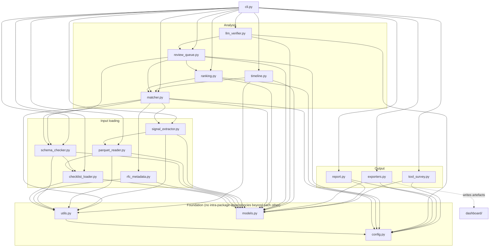
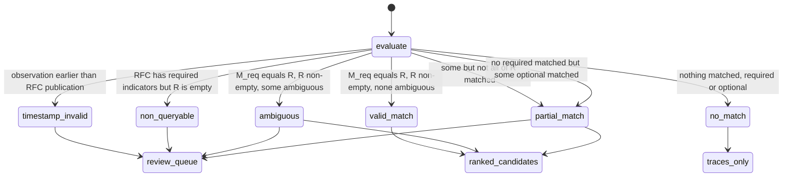

# Architecture

This document describes how the OpenINTEL RFC-adoption matching pipeline is put
together: what flows through it, which module owns which step, and where the
decisions that could reasonably have gone the other way were made and why.

It is hand-written and is not regenerated by any target. `make survey`
regenerates `open_source_tool_survey.md` in this directory; it does not touch
this file.

## 1. What the pipeline claims to do

The pipeline reads OpenINTEL DNS/DNSSEC measurement data in Parquet, extracts
normalized observations, tests those observations against a checklist of RFC
indicators, and produces **ranked RFC candidates** together with a reasoning
trace for every decision it made — including the negative ones.

The scope claim matters and is deliberately narrow. An observation that a zone
publishes a CDS record with algorithm 0 is consistent with RFC 8078 having been
implemented somewhere in that zone's provisioning chain. It is not proof of
adoption: the pipeline cannot see intent, cannot see software versions, and
cannot distinguish a deliberate delete signal from a misconfiguration that
happens to look like one. Every artefact the pipeline emits is therefore framed
as *evidence consistent with*, never as *adoption of*, and the reasoning trace
exists so a reader can disagree with a specific step rather than with the
verdict as a whole.

The corollary is that explainability is not a debugging feature that can be
switched off in production. A score with no derivation is not a research
result. This constraint shapes most of the design below.

## 2. Data flow

```
OpenINTEL Parquet (one file per measurement day, wide, schema evolves)
        |
        |  parquet_reader.read_parquet / read_many
        |  - resolve normalized field names to native OpenINTEL columns
        |  - project only the needed columns into the scan (DuckDB or pyarrow)
        v
Normalized frame (columns = normalized analysis field names)
        |
        |  signal_extractor.extract_signals
        |  - one ObservedSignal per row, with a minted signal_id
        |  - absent fields recorded as None, not dropped
        v
ObservedSignal[]
        |
        |  matcher.match_all, for each (signal x RFC in the checklist)
        |  - evaluate each IndicatorCondition with one of seven operators
        |  - AND the conditions within an indicator
        |  - skip indicators the schema check marked non_queryable
        v
IndicatorEvaluation[] per (signal, RFC)
        |
        |  timestamp cutoff
        |  - observation_timestamp < rfc_publication_date  =>  timestamp_invalid
        v
Decision + ScoreBreakdown per (signal, RFC)
        |
        +---> ReasoningTrace   (every pair, including no_match)
        +---> RFCMatch         (every pair)
        |
        |  ranking.rank_candidates
        |  - aggregate matches per RFC; no_match never enters the ranking
        v
RankedRFCCandidate[]
        |
        +---> review_queue.build_review_queue -> ReviewItem[] -> llm_verifier
        +---> timeline.build_timeline         -> AdoptionTimelineEntry[]
        |
        v
exporters + report  ->  JSON / CSV / Markdown in the output directory
        |
        v
dashboard/ (Streamlit) reads those artefacts by the names in config.OUTPUT_FILES
```

Two properties are worth stating explicitly because they constrain everything
downstream.

**Nothing is dropped silently.** A field the Parquet file does not carry
becomes an all-`None` column plus a warning, not a missing key. An indicator
whose field is absent from the dictionary becomes a `non_queryable` verdict in
the schema report plus a review item, not an unmatched indicator. The
difference between *we looked and found nothing* and *we could not look* is
preserved end to end, because conflating them is the most common way a
measurement study overstates its coverage.

**The trace is produced for negative results too.** `no_match` pairs generate a
full `ReasoningTrace` explaining which conditions failed and on what observed
values. Those traces are excluded from ranked candidates but written to disk,
because "RFC 5155 was considered and rejected because `rr_type` was DNSKEY, not
NSEC3" is a more useful statement than silence.

## 3. Module map

Every module in `src/openintel_rfc/`, one line each.

| Module | Responsibility |
| --- | --- |
| `__init__.py` | Package docstring, version re-export. Deliberately imports almost nothing so importing the package is free. |
| `config.py` | Constants: output filenames, scoring parameters, ID prefixes, package-relative default paths. No absolute paths. |
| `models.py` | Every Pydantic model exchanged between modules; the on-disk JSON contract the dashboard reads. |
| `utils.py` | Deterministic IO, timestamp parsing and normalization to naive UTC, ID minting, rounding, `PipelineError`, warning collection. |
| `checklist_loader.py` | Loads and validates the RFC checklist and the OpenINTEL dictionary; builds the indicator index. |
| `rfc_metadata.py` | Resolves RFC title and publication date. Offline checklist provider by default; Datatracker and RFC Editor XML providers exist but are inert without explicit opt-in. |
| `schema_checker.py` | Cross-checks each indicator's fields against the dictionary and assigns `queryable` / `partially_queryable` / `non_queryable`, with availability warnings. |
| `parquet_reader.py` | Resolves normalized field names to native OpenINTEL columns and reads a projected frame via DuckDB or the pyarrow/pandas fallback. |
| `signal_extractor.py` | Converts the normalized frame into `ObservedSignal` records with minted IDs and per-row provenance. |
| `matcher.py` | Evaluates conditions and indicators per (signal x RFC), applies the timestamp cutoff, computes the score breakdown, assigns the decision, and emits the reasoning trace. |
| `ranking.py` | Aggregates per-signal matches into `RankedRFCCandidate` rows and flags pairs that are too close to separate. |
| `review_queue.py` | Builds `ReviewItem` records from non-queryable indicators, ambiguity, partial matches, timestamp violations and close rankings. |
| `llm_verifier.py` | Produces `LLMVerification` verdicts for review items. Ships a deterministic rule-based backend; an LLM backend implements the same interface. |
| `timeline.py` | Builds per-RFC adoption timelines from valid matches only, bucketed monthly and yearly. |
| `exporters.py` | Writes every JSON envelope and CSV artefact deterministically, using the names in `config.OUTPUT_FILES`. |
| `report.py` | Renders the human-readable Markdown reports (`schema_check_report.md`, `report.md`). |
| `tool_survey.py` | Curated open-source tool survey as data; renders `docs/open_source_tool_survey.md`. Performs no network access. |
| `cli.py` | Argument parsing and orchestration for the `tool-survey`, `schema-check` and `analyze` subcommands. The only module that knows the run order. |

The Streamlit dashboard lives outside the package, in `dashboard/`, and reads
the exported artefacts rather than importing pipeline internals. That boundary
is intentional: the dashboard must work against an output directory produced by
a different checkout, and any coupling tighter than "file names in
`config.OUTPUT_FILES`" would break that.

There is no `pipeline.py`. `cli.py` owns the run order, and each stage module
is a pure function of its inputs. This keeps every stage independently testable
without a fixture that constructs a whole pipeline object.

## 4. Module dependency graph



The graph is acyclic and layered downward. `cli.py` is the only module with
broad fan-out, and it imports the stage modules lazily inside each subcommand
so that `openintel-rfc tool-survey` does not pay for importing DuckDB or
pandas.

## 5. Scoring

The formula is reproduced here exactly as specified in the build contract. It
is implemented in `matcher.py` using the constants in `config.py`; the constants
are imported, never re-hardcoded.

Per (signal × RFC):

```
base_indicator_score      = sum(weight of matched REQUIRED indicators)
optional_match_bonus      = sum(weight of matched OPTIONAL indicators) * 0.5   # config.OPTIONAL_WEIGHT_FACTOR
required_match_bonus      = 2.0 if (count(required indicators) >= 2 and all required matched) else 0.0
missing_required_penalty  = 3.0 * count(required indicators evaluated and NOT matched)
partial_match_penalty     = 2.0 if (some but not all required matched) else 0.0
ambiguity_penalty         = 2.0 if any matched indicator has ambiguous=True else 0.0

raw   = base + required_match_bonus + optional_match_bonus
        - missing_required_penalty - partial_match_penalty - ambiguity_penalty
final_score = round(max(0.0, raw) * specificity_multiplier, 4)
```

Specificity multipliers (`models.SPECIFICITY_MULTIPLIERS`): `very_high` 1.5,
`high` 1.25, `medium` 1.0, `low` 0.75.

Confidence from `final_score` (`models.CONFIDENCE_THRESHOLDS`): `>=12`
`very_high`, `>=8` `high`, `>=4` `medium`, `>0` `low`, otherwise `none`.

**Timestamp rule.** If `observation_timestamp < rfc_publication_date` the match
is `timestamp_invalid`: `final_score = 0.0`, and `timestamp_penalty` records the
score that *would* have been awarded. It is not a valid match and goes to the
review queue.

Three things about this formula are worth defending, since none of them is
forced by the data.

*The multiplier is applied last, after clamping at zero.* Specificity scales
evidence; it does not scale a deficit. Applying it before the clamp would make
a `very_high` RFC accumulate penalties 1.5× faster than a `low` one for the same
number of failed indicators, which inverts the intent — high specificity is
supposed to reward a distinctive match, not punish a near miss harder.

*A missing required indicator costs more than a matched one earns.* The penalty
is 3.0 against a default indicator weight of 1.0. This is asymmetric on purpose:
an RFC whose distinguishing mechanism was checked and not observed is weak
evidence for that RFC, and a symmetric scheme lets a pile of optional matches
outweigh a decisive negative.

*Ambiguity is a flat penalty, not a weight reduction.* An ambiguous indicator is
one whose observation is real but not uniquely attributable to this RFC. Scaling
its weight down would let a large enough number of ambiguous indicators
reconstruct a confident score. A flat penalty applied once caps that, and the
indicator is routed to the review queue regardless.

The timestamp penalty is recorded rather than discarded because "this would have
scored 9.375 had it been observed after publication" is exactly the number a
reviewer needs in order to judge whether the timestamp is the anomaly or the
match is.

## 6. Decision state machine

Let `R` be the required indicators of the RFC that were *evaluable*
(queryability other than `non_queryable`), `M_req` the matched required
indicators, and `M_opt` the matched optional indicators. The rules are evaluated
in this order; the first that applies wins.



The ordering carries meaning. The timestamp check runs first because it is a
statement about the *world*, not about the evidence: an observation predating
publication cannot be evidence of that RFC no matter how well the indicators
line up, so it must not be reachable through any other branch.
`non_queryable` runs second because "we could not test this" must not be
allowed to fall through into `no_match`, which would read as "we tested and
found nothing" and would silently understate what the corpus can support.

`no_match` is the only decision that produces a trace but no ranked candidate.
Everything else appears in the ranking, with `timestamp_invalid` scoring zero
and therefore sorting last while remaining visible.

### Condition operators

`matcher.py` implements seven operators: `equals`, `not_equals`, `in`, `exists`,
`contains`, `greater_or_equal`, `less_or_equal`. Conditions within an indicator
are ANDed; all must pass for the indicator to match.

A missing or `None` observed value fails **every** operator, including
`not_equals`. This is the design decision most likely to be questioned, so it is
worth stating plainly: absence is not evidence. A row that does not carry
`algorithm` at all does not thereby demonstrate that the algorithm is not 8. The
evaluation records `field_present=False` on the `ConditionEvaluation` and adds
the field to `missing_fields`, so the distinction between *failed* and
*unanswerable* survives into the trace and into the review queue.

Numeric comparisons coerce numeric strings, because OpenINTEL's column types
have varied across measurement generations. A genuine type mismatch fails with
an explanation rather than raising, since one badly typed row should not abort a
run over millions.

## 7. Normalized fields and OpenINTEL column aliases

The matcher reasons over ten normalized analysis fields. OpenINTEL exports one
column per record-type-specific attribute, so `algorithm` is not a column: it is
whichever of six columns is populated for the record type in that row. The
dictionary (`data/openintel_dictionary/sample_openintel_dictionary.json`) holds
the mapping, and `parquet_reader.resolve_columns` is the only place it is
applied.

| Normalized field | OpenINTEL native columns (`openintel_native_fields`) | Type | Available from |
| --- | --- | --- | --- |
| `timestamp` | `timestamp`, `year`, `month`, `day` | datetime | 2010-01-01 |
| `domain` | `query_name`, `response_name` | string | 2010-01-01 |
| `zone` | `source` | string | 2010-01-01 |
| `rr_type` | `response_type` | string | 2010-01-01 |
| `algorithm` | `dnskey_algorithm`, `ds_algorithm`, `rrsig_algorithm`, `cds_algorithm`, `cdnskey_algorithm`, `nsec3param_algorithm` | integer | 2010-01-01 |
| `digest_type` | `ds_digest_type`, `cds_digest_type` | integer | 2010-01-01 |
| `key_tag` | `ds_key_tag`, `rrsig_key_tag`, `cds_key_tag` | integer | 2010-01-01 |
| `flags` | `dnskey_flags`, `nsec3param_flags`, `cdnskey_flags` | string | 2016-01-01 |
| `source` | `source` | string | 2010-01-01 |
| `measurement_id` | (none) | string | 2010-01-01 |

Resolution order is fixed so the answer never depends on dictionary iteration
order:

1. exact match on the normalized field name;
2. each entry of `openintel_native_fields`, in the order the dictionary lists
   them;
3. case-insensitive match on the normalized field name.

The mapping is deliberately not injective: `zone` and `source` both resolve to
OpenINTEL's `source` column, which is correct — the measurement partition
identifier is the best available proxy for the zone. Fields that resolve to
nothing become all-`None` columns with a warning.

Two consequences deserve attention.

`available_from` is a real constraint, not documentation. `flags` is only
reliably populated from 2016-01-01, which is *after* the publication date of
several RFCs in the checklist. An indicator that depends on `flags` therefore
cannot be evaluated for observations before 2016 even though the RFC existed,
and the schema checker raises an availability warning rather than letting the
indicator quietly fail on every older row.

`measurement_id` has no native column at all. It is carried in the model because
downstream consumers benefit from a per-measurement handle, and it is populated
from run provenance rather than from the file. It resolves to `None` and warns,
which is the honest outcome.

## 8. Extension points

**New RFCs.** Add an entry to `data/rfc_checklists/dnssec_rfc_checklists.json`
with its indicators; no code changes. Run `schema-check` first — it will report
which of the new indicators are actually queryable against the dictionary
before any analysis run wastes time on them. The main authoring risk is
specificity inflation: marking a new RFC `very_high` applies a 1.5× multiplier
to every match, so the field should reflect how uniquely the indicators identify
that RFC, not how interesting the RFC is.

**New operators.** Add the literal to `models.ConditionOp` and the
implementation to the operator dispatch in `matcher.py`. Two obligations come
with it: the operator must define its behaviour on a missing value (the existing
seven all fail, and a new one that does not would break the absence-is-not-
evidence invariant), and it must produce explanation text, because a condition
that cannot explain itself cannot appear in a trace.

**New metadata backends.** `rfc_metadata.py` defines `RFCMetadataProvider` with
`fetch` and `fetch_many`. `ChecklistMetadataProvider` is the offline default.
`DatatrackerMetadataProvider` and `RFCEditorXMLMetadataProvider` are written as
real integrations against documented endpoints, but are inert unless constructed
with `enable_network=True`, and nothing in the pipeline constructs them. A new
backend implements the same two methods. The invariant a backend must not break:
never return a silently empty result, because a missing publication date turns
every timestamp check into a pass, which is the failure mode that would most
quietly corrupt the output. Providers raise `PipelineError` instead.

**Multi-file Parquet.** `parquet_reader.read_many` already exists and takes a
sequence of paths, unioning them into one normalized frame with an `origin_file`
provenance column that `signal_extractor` picks up per row. `limit` is a cap on
total rows rather than per file, so early files are not truncated to make room
for later ones. The MVP CLI passes a single file; widening it to a glob is a CLI
change, not an engine change. Files from different measurement generations are
handled by the alias resolution, which runs per file against that file's actual
schema.

**New output artefacts.** Add the filename to `config.OUTPUT_FILES` and the
writer to `exporters.py`. The dashboard discovers artefacts through that dict,
so a new artefact becomes visible to it without a second registration step.

## 9. Design tradeoffs

**Explainability is paid for in volume.** Every (signal × RFC) pair produces a
full `ReasoningTrace` with per-condition evaluations. For *n* signals and *m*
RFCs that is *n × m* traces, and the traces are larger than the matches they
explain. `reasoning_traces.json` will be the largest artefact of any run by a
wide margin. This was accepted because a match without a derivation is not a
research result; the mitigation is `RunConfig.limit`, not a reduced trace.

**Determinism over speed.** Collections are sorted by explicit keys before
emission, scores are rounded to a fixed precision, and `OPENINTEL_RFC_DETERMINISTIC=1`
freezes the timestamp so two runs over the same input produce byte-identical
output. Sorting costs time that a streaming design would not spend. Byte-stable
output means a diff between two runs shows only genuine changes, which is worth
more here than throughput.

**Row-wise evaluation instead of vectorized predicates.** The matcher evaluates
one signal at a time in Python rather than pushing indicator conditions into
DuckDB as SQL. Vectorizing would be substantially faster and would make
per-condition explanation text impractical — the explanation is per row, and a
vectorized predicate produces a boolean mask with nothing attached to it. The
column projection in the reader is where the performance actually matters, and
that *is* pushed down.

**Two read engines, one required output.** DuckDB and the pyarrow/pandas
fallback must produce identical frames, including dtypes. This is duplicated
work and a standing test obligation, and it exists so that a run is reproducible
on a machine where DuckDB is unavailable. A run whose result depends on which
libraries happened to be installed would undermine the reproducibility claim the
rest of the design is built on.

**`extra="forbid"` on every model.** A typo in a hand-edited checklist fails at
load with a pointer to the offending key. The cost is that a future OpenINTEL
dictionary field breaks the load rather than being ignored, making input-format
evolution a code change. For hand-maintained research inputs, failing loudly on
an unrecognized key is worth more than tolerating one, because the alternative
failure — an indicator that silently never matches because its field name was
misspelled — is invisible in the output.

**The deterministic LLM verifier.** `llm_verifier.py` ships a rule-based backend
that applies `config.LLM_AUTO_ACCEPT_CONFIDENCES` and explains itself. It is not
a placeholder: a real LLM in the default path would make runs non-reproducible
and would require network access and credentials for the demo to work. The
interface exists so an LLM backend can be added, and any such verdict stays
advisory — recorded on the review item, never permitted to overwrite a
deterministic score.

**Checklist-sourced publication dates.** Publication dates come from the
hand-maintained checklist rather than from the Datatracker. They drive the
timestamp cutoff, so they are correctness-critical, and transcribing them by
hand is a real risk. It is accepted because eight dates are auditable by
inspection, whereas a network call in the default path is not reproducible and
not offline-runnable. The reconciliation path is `rfc_metadata.py`, and the
number of checklist entries at which hand-maintenance stops being defensible is
low — this is the assumption most likely to need revisiting first.

**Artefact-mediated dashboard coupling.** The dashboard reads exported files by
name rather than importing pipeline internals, so it can open an output
directory produced by a different checkout. The cost is that
`config.OUTPUT_FILES` and the JSON envelope keys are a public contract that
cannot be refactored freely. That was the intended trade.
