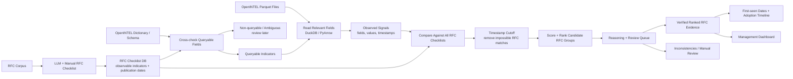

# OpenINTEL RFC-Adoption Matching Pipeline

Match large-scale DNS/DNSSEC measurement data from [OpenINTEL](https://openintel.nl)
against a database of RFC checklists, and produce **ranked RFC candidates with
explicit, inspectable reasoning** — not a single opaque label.

## Project goal

Given three inputs:

1. an **RFC checklist / signature database** (observable indicators + publication dates),
2. an **OpenINTEL dictionary / schema** (which fields the corpus actually exports),
3. **OpenINTEL-style Parquet files** of DNS measurements,

the system determines which RFCs are *consistent with* the observed signals, how
strongly, since when, and — critically — **why**.

## What the system does

- Cross-checks every RFC-derived indicator against the OpenINTEL dictionary and
  classifies it `queryable`, `partially_queryable`, `non_queryable`, or `ambiguous`.
- Reads OpenINTEL Parquet with DuckDB (projection pushdown; pandas/PyArrow fallback),
  resolving real column names (`response_type`, `cds_algorithm`, …) to normalized
  analysis fields (`rr_type`, `algorithm`, …).
- Extracts normalized **observed signals** from measurement rows.
- Compares **every** observed signal against **every** RFC checklist. It never picks
  one RFC up front, and a signal is allowed to match several RFCs at once.
- Applies **publication-date cutoff logic**: an observation that predates an RFC
  cannot evidence its adoption.
- Ranks candidate RFCs with an itemized, reproducible score.
- Emits a **structured decision trace** for every single signal × RFC evaluation —
  matches, partial matches, rejections, and timestamp-invalid cases alike.
- Routes missing fields, ambiguity, and inconsistencies to a **review queue**.
- Exports JSON, CSV and Markdown, and ships a nine-page Streamlit dashboard.

## What the system does *not* claim

> This pipeline does not prove RFC adoption by itself. It identifies ranked RFC
> candidates based on OpenINTEL-observable signals and timestamp consistency.

Concretely:

- A record matching an RFC's signature shows the *mechanism* is present. It does not
  show the operator read the RFC, nor that the deployment is conformant.
- Broad base-DNSSEC RFCs (4033/4034/4035) match almost any signed zone. Their low
  specificity multiplier reflects that; they are evidence of DNSSEC, not of a choice.
- Recommendation-oriented RFCs (e.g. 8624) are **not** directly observable. Their
  indicators are marked ambiguous and always routed to review.
- Absence of a signal is not evidence of absence: it may mean the corpus does not
  export the field, or the measurement did not cover the name.
- The shipped sample Parquet is **synthetic**, built to exercise every code path.

## Architecture overview



Module map (`src/openintel_rfc/`):

| Module | Responsibility |
| --- | --- |
| `models.py` | Pydantic models for every artefact; the integration contract |
| `config.py` | Constants, scoring parameters, output file names |
| `utils.py` | Deterministic IO, timestamp parsing, ID minting |
| `checklist_loader.py` | Load + validate the checklist DB and dictionary |
| `rfc_metadata.py` | RFC metadata interface (offline default; Datatracker/RFCXML seams) |
| `schema_checker.py` | Indicator × dictionary cross-check and queryability verdicts |
| `parquet_reader.py` | DuckDB/PyArrow Parquet reads with alias resolution |
| `signal_extractor.py` | Parquet rows → normalized `ObservedSignal`s |
| `matcher.py` | Condition/indicator evaluation, timestamp cutoff |
| `ranking.py` | Score breakdown, confidence, candidate aggregation |
| `reasoning.py` | Structured decision traces and their prose summaries |
| `timeline.py` | First-seen dates and adoption trajectories |
| `review_queue.py` | Everything a human should look at, with severity |
| `llm_verifier.py` | Verification interface + deterministic offline backend |
| `report.py` | `report.md` and the schema-check report |
| `exporters.py` | JSON / CSV / Markdown writers |
| `dashboard_data.py` | The dashboard's only data-access layer |
| `tool_survey.py` | Generates the open-source tool survey |
| `cli.py` | `tool-survey`, `schema-check`, `analyze` |

See [`docs/architecture.md`](docs/architecture.md) for the full data flow and
extension points.

## Selected open-source tool stack

| Tool | Role | Why |
| --- | --- | --- |
| **DuckDB** | Default Parquet query engine | SQL directly over Parquet with projection and predicate pushdown; zero-setup, single-file, ideal for OpenINTEL-shaped columnar data |
| **PyArrow** | Parquet IO | The Parquet backend, and the fallback read path |
| **pandas** | DataFrame handling | Simple manipulation, CSV/JSON export, native Streamlit rendering |
| **Pydantic** | Typed models | Malformed checklists fail loudly at load time instead of producing wrong matches |
| **Streamlit** | Dashboard | Multipage management UI in pure Python |
| **Plotly** | Charts | Interactive rankings, timelines and distributions |
| **pytest** | Tests | End-to-end and unit coverage |

Full evaluation — including what was deliberately rejected and why — is in
[`docs/open_source_tool_survey.md`](docs/open_source_tool_survey.md).

## The RFC checklist / signature database

`data/rfc_checklists/dnssec_rfc_checklists.json`. Each RFC carries `rfc_id`, `title`,
`publication_date`, `protocol`, `specificity`, `description`, `references`, `notes`,
and a list of `indicators`. Each indicator has an `id`, `description`, `required`
flag, `weight`, an `ambiguous` flag, and a list of `conditions`:

```json
{
  "id": "rfc8078_cds_cdnskey_algorithm_zero",
  "description": "CDS or CDNSKEY record with algorithm field 0 (the delete signal)",
  "required": true,
  "weight": 10,
  "conditions": [
    {"field": "rr_type", "op": "in", "value": ["CDS", "CDNSKEY"]},
    {"field": "algorithm", "op": "equals", "value": 0}
  ]
}
```

Conditions within an indicator are ANDed. Supported operators: `equals`,
`not_equals`, `in`, `exists`, `contains`, `greater_or_equal`, `less_or_equal`.

Shipped RFCs: **4033** (with 4034/4035, base DNSSEC), **4509** (SHA-256 DS digest),
**5155** (NSEC3), **6605** (ECDSA), **7344** (CDS/CDNSKEY), **8078** (delete signal),
**8080** (EdDSA), **8624** (algorithm recommendations).

Two indicators are intentionally *not* satisfiable by the shipped dictionary, so the
missing-field paths are exercised by the demo rather than only by tests:
`rfc8624_validator_algorithm_support` (non-queryable) and
`rfc4033_dnssec_ok_negotiated` (partially queryable).

## OpenINTEL dictionary / schema alignment

`data/openintel_dictionary/sample_openintel_dictionary.json` describes each analysis
field with a `type`, `description`, `available_from` date, and the real OpenINTEL
column names it derives from:

```json
{
  "name": "algorithm",
  "type": "integer",
  "available_from": "2010-01-01",
  "openintel_native_fields": ["dnskey_algorithm", "ds_algorithm", "rrsig_algorithm",
                              "cds_algorithm", "cdnskey_algorithm"]
}
```

The schema checker walks every condition of every indicator and reports, in prose,
whether the corpus can answer it. `available_from` matters: the dictionary's `flags`
field only becomes available in 2016, so any indicator depending on it cannot speak
to adoption before then — and the report says so explicitly rather than returning a
confident zero.

## Timestamp cutoff

For each signal × RFC pair the pipeline compares the observation timestamp with the
RFC's publication date. If `observation_timestamp < rfc_publication_date` the match is
`timestamp_invalid`: its score is forfeited to `0.0`, it is excluded from ranking and
from `first_seen`, and it is pushed to the review queue at **high** severity. The
score that *would* have been awarded is preserved in `score_breakdown.timestamp_penalty`,
so a reviewer can see exactly what was withheld.

This is what separates "these bytes look like RFC 8078" from "this is evidence of
RFC 8078 adoption". A CDS record with algorithm 0 in 2016 is a real observation of
something — but it cannot be adoption of a document published in March 2017.

## Ranking

```
base_indicator_score      = sum(weight of matched REQUIRED indicators)
optional_match_bonus      = sum(weight of matched OPTIONAL indicators) * 0.5
required_match_bonus      = 2.0  if the RFC has >= 2 required indicators and all matched
missing_required_penalty  = 3.0 * (required indicators evaluated and not matched)
partial_match_penalty     = 2.0  if some but not all required indicators matched
ambiguity_penalty         = 2.0  if any matched indicator is flagged ambiguous

final_score = max(0, base + required_bonus + optional_bonus
                     - missing_required_penalty - partial_match_penalty
                     - ambiguity_penalty) * specificity_multiplier
```

Specificity multipliers: `very_high 1.5`, `high 1.25`, `medium 1.0`, `low 0.75`.
Confidence bands: `>=12 very_high`, `>=8 high`, `>=4 medium`, `>0 low`.

The effect is that a specific RFC outranks the broad one it builds on. A CDS record
with `algorithm=0` scores RFC 8078 at `17.25` (very_high) and RFC 7344 at `11.25`
(high) — both are true, and the ordering says which one explains the observation.

Every term is recorded in `ScoreBreakdown.steps` as readable arithmetic, so any
score can be recomputed by hand from the output.

## Reasoning traces

The pipeline emits **no hidden chain-of-thought**. It emits explicit, structured
decision records — one per signal × RFC evaluation:

```json
{
  "signal_id": "sig_0001",
  "rfc_id": "RFC 8078",
  "decision": "valid_match",
  "reasoning_summary": "Observed CDS record with algorithm=0 after RFC 8078 publication date.",
  "matched_conditions": [
    {"field": "rr_type", "op": "in", "expected": ["CDS", "CDNSKEY"], "observed": "CDS", "passed": true},
    {"field": "algorithm", "op": "equals", "expected": 0, "observed": 0, "passed": true}
  ],
  "failed_conditions": [],
  "timestamp_check": {
    "observation_timestamp": "2018-05-01",
    "rfc_publication_date": "2017-03-01",
    "valid": true,
    "explanation": "Observation occurs after RFC publication."
  },
  "score_breakdown": {
    "base_indicator_score": 10, "specificity_multiplier": 1.5,
    "required_match_bonus": 0, "missing_required_penalty": 0,
    "partial_match_penalty": 0, "timestamp_penalty": 0, "final_score": 15
  }
}
```

Each trace answers: which RFC was considered, which indicator was checked, which
OpenINTEL field was used, what passed, what failed, whether the timestamp was valid,
why the score is what it is, why one match outranks another, what evidence supports
the result, and what is missing or uncertain.

Decisions: `valid_match`, `partial_match`, `no_match`, `timestamp_invalid`,
`non_queryable`, `ambiguous`. `no_match` traces are kept — explaining why an RFC was
*rejected* is as important as explaining why one matched.

## Dashboard pages

| Page | Contents |
| --- | --- |
| 1. Overview | Corpus/checklist counters, matches per RFC, queryability split, review severity |
| 2. Schema Check | Dictionary fields, indicator queryability, missing fields, per-indicator reasoning |
| 3. RFC Checklists | Browse RFCs, publication dates, indicators, weights, conditions |
| 4. OpenINTEL Data Explorer | Sample rows, extracted signals, `rr_type`/`algorithm`/`digest_type` distributions, observations over time |
| 5. Matching Results | Ranked candidates with score, confidence, first-seen, matched fields, filters |
| 6. Reasoning Explorer | Per-trace matched/failed conditions, timestamp verdict, score breakdown — the transparency page |
| 7. Adoption Timeline | First-seen per RFC, monthly/yearly counts, domain/zone spread |
| 8. Review Queue | Severity-ranked items with evidence; mark accepted / rejected / needs follow-up |
| 9. Export Center | Download every JSON, CSV and Markdown artefact |

The dashboard reads `demo_output/` by default and lets you point at another output
directory from the sidebar.

## Installation

```bash
cd openintel_rfc_pipeline
pip install -r requirements.txt
```

Python 3.10+. All commands below run from the `openintel_rfc_pipeline/` directory.
The package lives under `src/`, so either `pip install -e .` or set `PYTHONPATH=src`
(the `Makefile` does this for you).

## Demo commands

```bash
pip install -r requirements.txt

python data/sample_parquet/create_sample_parquet.py

python -m openintel_rfc.cli tool-survey --out docs/open_source_tool_survey.md

python -m openintel_rfc.cli schema-check \
  --checklists data/rfc_checklists/dnssec_rfc_checklists.json \
  --dictionary data/openintel_dictionary/sample_openintel_dictionary.json \
  --out demo_output

python -m openintel_rfc.cli analyze \
  --checklists data/rfc_checklists/dnssec_rfc_checklists.json \
  --dictionary data/openintel_dictionary/sample_openintel_dictionary.json \
  --parquet data/sample_parquet/sample_openintel.parquet \
  --out demo_output

streamlit run dashboard/app.py
```

Or simply `make demo && make dashboard`.

### Outputs

`schema-check` writes `queryable_indicators.json`, `non_queryable_indicators.json`,
`schema_check_report.md`, `schema_check.csv`, `schema_check.json`.

`analyze` writes `observed_signals.json`, `rfc_matches.json`, `reasoning_traces.json`,
`review_queue.json`, `adoption_timeline.json`, `ranked_candidates.json`, `report.md`,
`run_manifest.json`, and CSV equivalents for matches, review queue, timeline, signals
and traces.

## Testing

```bash
pytest
```

Covers the schema checker, signal extraction, matching, the timestamp cutoff,
ranking order, reasoning-trace completeness, the review queue, timeline first-seen
computation, both CLI commands end-to-end, and the dashboard data loader.

## Limitations

- **The pipeline does not prove adoption.** It ranks candidates consistent with
  observable signals and timestamp constraints.
- The sample Parquet is synthetic. Numbers in the demo report describe that fixture,
  not the real DNS.
- Matching is **record-level**. Zone-level conclusions ("this zone adopted NSEC3")
  need aggregation the MVP does not perform.
- Only one Parquet file is read per run. `read_many` exists as the seam for the real
  partitioned corpus (`fdns/basis=zonefile/source=…/year=…/month=…/day=…`).
- The checklist DB is hand-curated for eight DNSSEC RFCs. The LLM-assisted extraction
  path for building it at scale is designed but not wired to a backend.
- Some RFC requirements are simply not observable in passive forward-DNS measurement
  (resolver-side behaviour, DO-bit negotiation, validation outcomes). These are
  surfaced as non-queryable rather than silently ignored.
- `first_seen` is bounded by measurement coverage: it is the first date *in this
  corpus*, not the first date on the Internet.

## Next steps

1. Read the real OpenINTEL S3 corpus directly (the repo root already has a working
   boto3 client) and partition-scan by date instead of a single local file.
2. Aggregate record-level matches to zone- and TLD-level adoption statistics.
3. Wire `rfc_metadata.py` to the IETF Datatracker API so publication dates come from
   the source of truth rather than the checklist file.
4. Wire `llm_verifier.py` to a real structured-output backend for the ambiguous and
   partial cases, keeping the deterministic verifier as the offline default.
5. Expand the checklist DB beyond DNSSEC, with LLM-assisted extraction from RFCXML
   plus human review through the existing review queue.
6. Add zone-level time-series regression to distinguish genuine adoption events from
   measurement artefacts.
